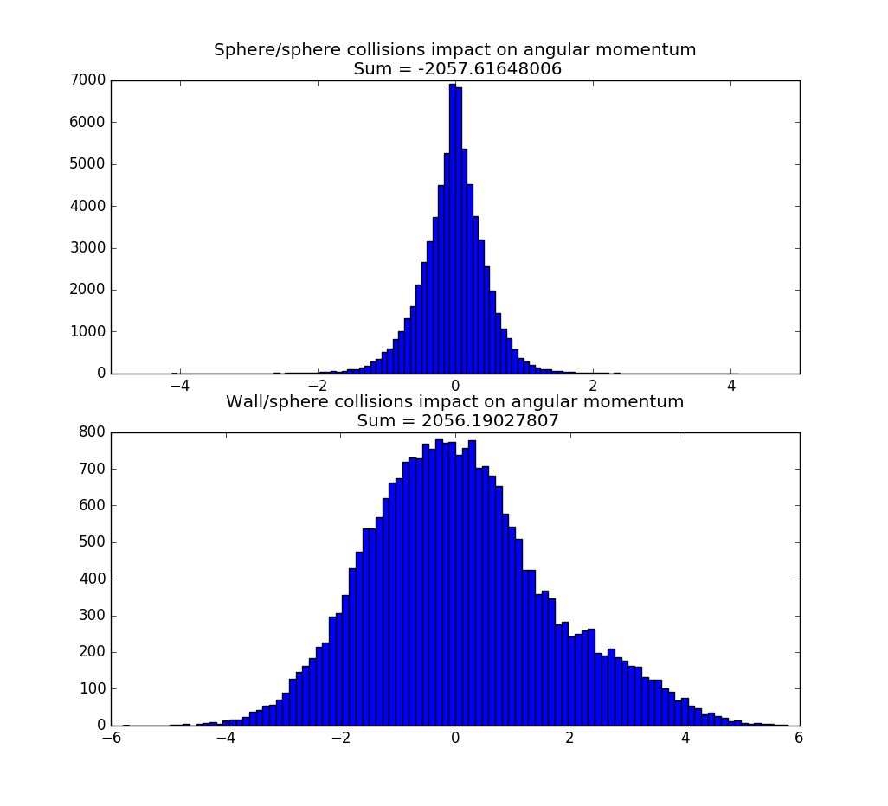

<a href="histograms#mu">Varying Sphere/Sphere Friction </a>
 
<a href="histograms#wmu">Varying Wall/Sphere Friction </a>
 
<a href="histograms#amp">Varying Boundary Amplitude</a>
 
<a href="histograms#N">Varying Number of Spheres </a>
  

<h3>Default:</h3>  Sphere/Sphere Friction (mu): 2  Wall/Sphere Friction (wmu): 4  Boundary Amplitude (amp): 0.5  Number of Spheres (N): 13 
<h4>What's going on?</h4>
 This page contains histograms which detail the contribution of sphere/sphere and wall/sphere collisions to the counter-rotation phenomenon observed in the simulations. The intensity of this phenomenon is estimated by measuring the average total angular momentum of the spheres about their center of mass across a span of 1000 collisions (about 50 seconds of swirling).   
Before each image, three statistics are listed: the initial angular momentum, the final angular momentum, and the average angular momentum. Since the input configuration of the spheres (initial positions and velocities) is never modified, the initial angular momentum is the same across all experiments. The final angular momentum is the measured angular momentum after the 1000th (and final) collision of the experiment. The average angular momentum across all collisions tends to be negative when the phenomenon occurs.  

Initial Angular Momentum: 1.8165000000000002 
Final Angular Momentum: 0.39029800982234564 
Average Angular Momentum: -2.3990410102472923 

<h3>Varying Sphere/Sphere Friction</h3>

mu = 0

mu = 0.5

mu = 1

mu = 1.5

mu = 2 

mu = 2.5

mu = 3

mu = 3.5

mu = 4

mu = 4.5

mu = 5


<h3>Varying Wall/Sphere Friction</h3>

Foo


<h3>Varying Boundary Amplitude</h3>

Foo


<h3>Varying Number of Spheres</h3>

Foo


