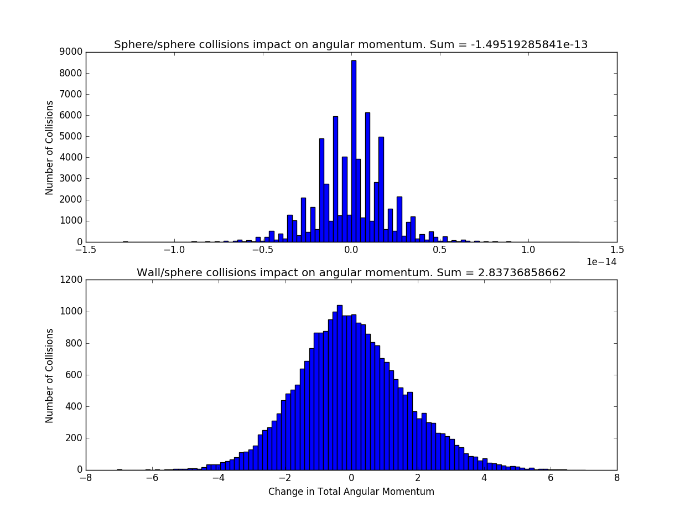
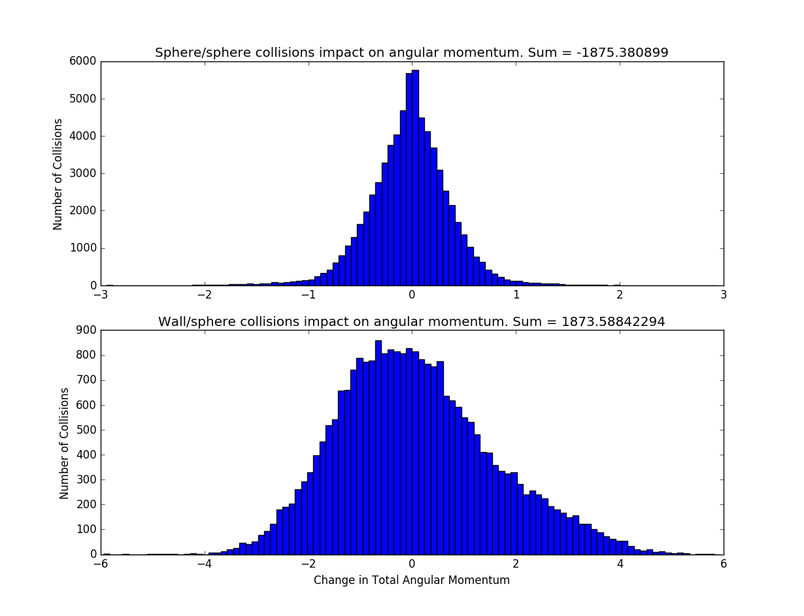
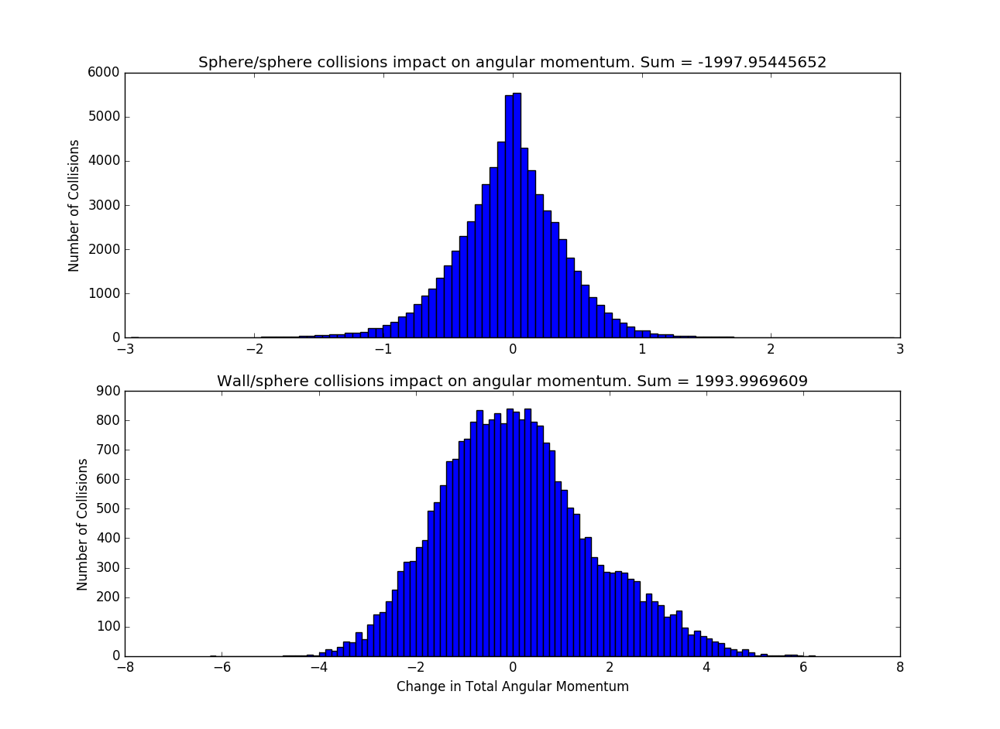
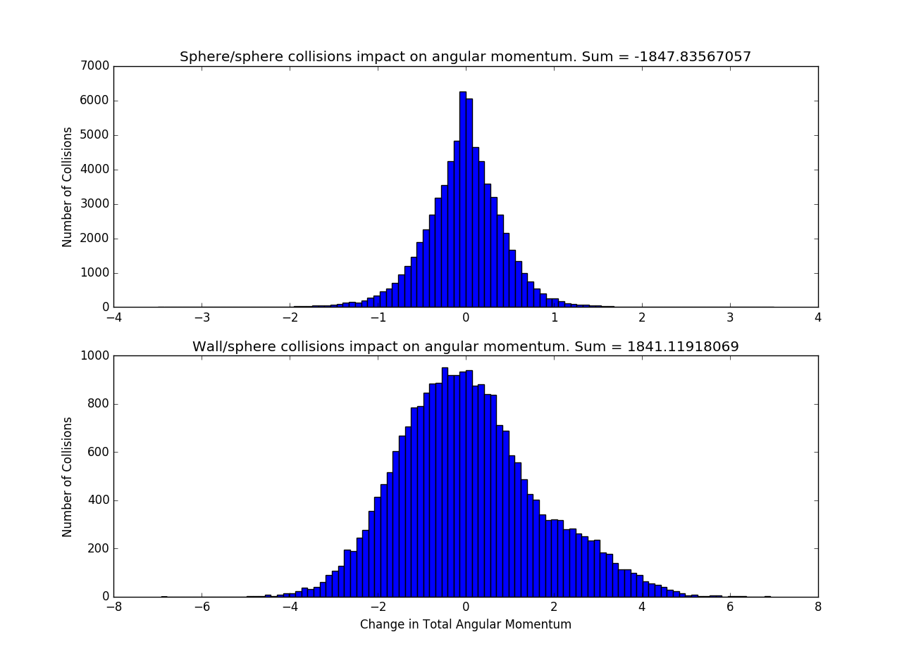
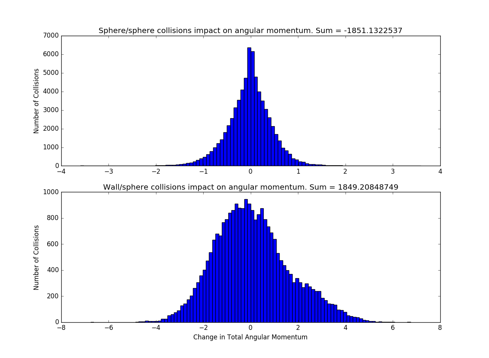

<h4>Description:</h4>
 This page contains histograms which detail the contribution of sphere/sphere and wall/sphere collisions to the counter-rotation phenomenon observed in the simulations. The intensity of this phenomenon is estimated by measuring the average total angular momentum of the spheres about their center of mass across a span of 1000 collisions (about 50 seconds of swirling).   
Before each image, three statistics are listed: the initial angular momentum, the final angular momentum, and the average angular momentum. Since the input configuration of the spheres (initial positions and velocities) is never modified, the initial angular momentum is the same across all experiments. The final angular momentum is the measured angular momentum after the 1000th (and final) collision of the experiment. The average angular momentum across all collisions tends to be negative when the phenomenon occurs.  
The title of each histogram includes the sum of all changes to total angular momentum displayed. As a sanity check, notice that the sum of all changes to angular momentum by sphere/sphere collisions and wall/sphere collisions is the difference between initial and final angular momentum. If you want to see a bigger version of an image, just click on it. 
<h3>Default:</h3>  Sphere/Sphere Friction (mu): 2  Wall/Sphere Friction (wmu): 4  Boundary Amplitude (amp): 0.5  Number of Spheres (N): 13 

Initial Angular Momentum: 1.8165000000000002 
Final Angular Momentum: 0.39029800982234564 
Average Angular Momentum: -2.3990410102472923 

<a href="histograms#mu">Varying Sphere/Sphere Friction </a>
 
<a href="histograms#wmu">Varying Wall/Sphere Friction </a>
 
<a href="histograms#amp">Varying Boundary Amplitude</a>
 
<a href="histograms#N">Varying Number of Spheres </a>

<h3>Varying Sphere/Sphere Friction</h3>

mu = 0  Note that sphere/sphere collisions contribute nothing to total angular momentum in this case, since they are elastic.

Initial Angular Momentum: 1.8165000000000002 
Final Angular Momentum: 4.436919282387839 
Average Angular Momentum: -0.1346943994896573 

mu = 0.5

Initial Angular Momentum: 1.8165000000000002 
Final Angular Momentum: -0.35438184325433686 
Average Angular Momentum: -1.843237454029892 

mu = 1

Initial Angular Momentum: 1.8165000000000002 
Final Angular Momentum: -4.698187263524518 
Average Angular Momentum: -2.3053073243280124 

mu = 1.5

Initial Angular Momentum: 1.8165000000000002 
Final Angular Momentum: -7.082148915045604 
Average Angular Momentum: -2.3685067420080035 

mu = 2

Initial Angular Momentum: 1.8165000000000002 
Final Angular Momentum: 0.39029800982234564 
Average Angular Momentum: -2.3990410102472923 

mu = 2.5

Initial Angular Momentum: 1.8165000000000002 
Final Angular Momentum: -0.10726621487923393 
Average Angular Momentum: -2.4223254207736202 

mu = 3

Initial Angular Momentum: 1.8165000000000002 
Final Angular Momentum: -3.111487933984278 
Average Angular Momentum: -2.3506385698182393 

<h3>Varying Wall/Sphere Friction</h3>

Foo

<h3>Varying Boundary Amplitude</h3>

Foo

<h3>Varying Number of Spheres</h3>

Foo

