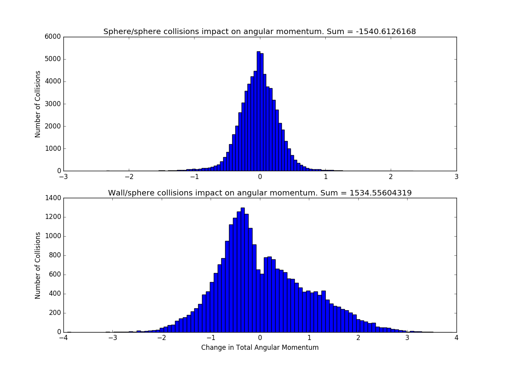

<h4>Description:</h4>
 This page contains histograms which detail the contribution of sphere/sphere and wall/sphere collisions to the counter-rotation phenomenon observed in the simulations. The intensity of this phenomenon is estimated by measuring the average total angular momentum of the spheres about their center of mass across a span of 100,000 collisions (about 50 seconds of swirling).   
Before each image, three statistics are listed: the initial angular momentum, the final angular momentum, and the average angular momentum. Since the input configuration of the spheres (initial positions and velocities) is never modified, the initial angular momentum is the same across all experiments. The final angular momentum is the measured angular momentum after the 1000th (and final) collision of the experiment. The average angular momentum across all collisions tends to be negative when the phenomenon occurs.  
The title of each histogram includes the sum of all changes to total angular momentum displayed. As a sanity check, notice that the sum of all changes to angular momentum by sphere/sphere collisions and wall/sphere collisions is the difference between initial and final angular momentum. If you want to see a bigger version of an image, just click on it. 
<h3>Default:</h3>  Sphere/Sphere Friction (mu): 0.2  Wall/Sphere Friction (wmu): 0.2  Boundary Amplitude (amp): 0.5  Number of Spheres (N): 13 

Initial Angular Momentum: 1.8165000000000002 
Final Angular Momentum: -4.240073606444323 
Average Angular Momentum: -0.3869276931644715 

<a href="histograms#mu">Varying Sphere/Sphere Friction </a>
 
<a href="histograms#wmu">Varying Wall/Sphere Friction </a>
 
<a href="histograms#amp">Varying Boundary Amplitude</a>
 
<a href="histograms#N">Varying Number of Spheres </a>

<h3>Varying Sphere/Sphere Friction</h3>

mu = 0  Note that sphere/sphere collisions contribute nothing to total angular momentum in this case, since they are elastic.

Initial Angular Momentum: 1.8165000000000002 
Final Angular Momentum: -0.32527910128387616 
Average Angular Momentum: 0.5800752989128658 

mu = 0.2

Initial Angular Momentum: 1.8165000000000002 
Final Angular Momentum: -4.240073606444323 
Average Angular Momentum: -0.3869276931644715 

mu = 0.4

Initial Angular Momentum: 1.8165000000000002 
Final Angular Momentum: -2.240967241856384 
Average Angular Momentum: -1.250061821494596 

mu = 0.6

Initial Angular Momentum: 1.8165000000000002 
Final Angular Momentum: -0.926767420215738 
Average Angular Momentum: -1.6995182951758976 

mu = 0.8

Initial Angular Momentum: 1.8165000000000002 
Final Angular Momentum: 1.9285761127454648 
Average Angular Momentum: -1.9364883052638313 

mu = 1.0

Initial Angular Momentum: 1.8165000000000002 
Final Angular Momentum: 1.9609167609707332 
Average Angular Momentum: -2.055621564987872 

<h3>Varying Wall/Sphere Friction</h3>

wmu = 0

Initial Angular Momentum: 1.8165000000000002 
Final Angular Momentum: 8.88546574107103 
Average Angular Momentum: 5.426212771537266 

wmu = 0.2

Initial Angular Momentum: 1.8165000000000002 
Final Angular Momentum: -4.240073606444323 
Average Angular Momentum: -0.3869276931644715 

wmu = 0.4

Initial Angular Momentum: 1.8165000000000002 
pythonFinal Angular Momentum: -2.3420373344703123 
Average Angular Momentum: -0.8002175095029151 

wmu = 0.6

Initial Angular Momentum: 1.8165000000000002 
Final Angular Momentum: -1.0290236564433852 
Average Angular Momentum: -0.8603895162470843 

wmu = 0.8

Initial Angular Momentum: 1.8165000000000002 
Final Angular Momentum: -4.632233355994766 
Average Angular Momentum: -0.8528599368928911 

wmu = 1.0

Initial Angular Momentum: 1.8165000000000002 
Final Angular Momentum: 0.8729084338063045 
Average Angular Momentum: -1.0379800408213296 

<h3>Varying Boundary Amplitude</h3>

Foo

<h3>Varying Number of Spheres</h3>

Foo

